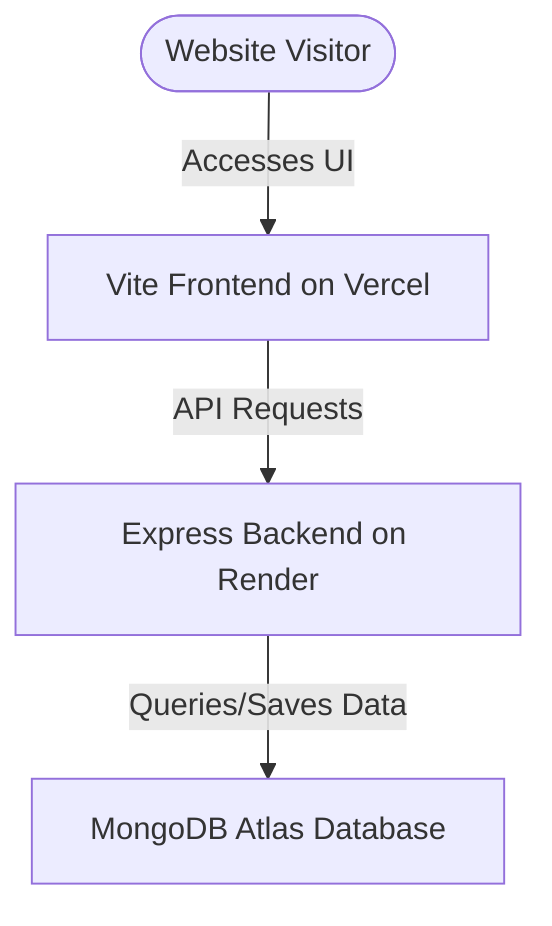

# Step-by-Step Deployment Plan (100% Free)

This guide provides the complete blueprint for deploying your full-stack portfolio website for free.

## Deployment Architecture Overview


---

## Step 1: Deploy the Database (MongoDB Atlas)
Since your portfolio loads projects, experiences, and certifications dynamically, you need a cloud-hosted database. MongoDB Atlas offers a generous **M0 Shared Free Tier** (512 MB storage, which is more than enough).

1. **Sign Up & Cluster Creation:**
   * Go to [MongoDB Atlas](https://www.mongodb.com/cloud/atlas/register) and create a free account.
   * Create a new deployment and select **M0 (Free)**.
   * Choose a provider (e.g., AWS) and region closest to you or your target audience (e.g., N. Virginia or Singapore).
   * Name your cluster (e.g., `PortfolioCluster`).

2. **Database Access Security:**
   * Create a **Database User** with a username and a strong password. Note these down.
   * Under **Network Access**, click **Add IP Address** and choose **Allow Access from Anywhere** (`0.0.0.0/0`). This is necessary because serverless platforms like Render do not have static IP addresses.

3. **Get Your Connection String:**
   * Go to the database dashboard and click **Connect**.
   * Choose **Drivers** (Node.js).
   * Copy the connection string. It will look like:
     ```text
     mongodb+srv://<username>:<password>@portfoliocluster.xxxx.mongodb.net/?retryWrites=true&w=majority
     ```
   * Replace `<username>` and `<password>` with your database user credentials.

---

## Step 2: Seed the Production Database
Before deploying your server, you should populate the cloud database with your portfolio data.

1. In your local workspace, open the `server/.env` file.
2. Temporary change your local `MONGO_URI` to point to the **MongoDB Atlas connection string** you copied in Step 1.
3. Open a terminal in the `server` directory and run:
   ```bash
   node scripts/seedData.js
   ```
4. Confirm in the Atlas dashboard (Browse Collections) that your collections (`projects`, `skills`, `experiences`, `researches`, `certifications`) are loaded with your profile data.
5. Revert your local `server/.env` to point back to your local MongoDB if you wish to continue local development.

---

## Step 3: Deploy the Backend (Render)
Render is an excellent cloud platform that hosts Node.js apps for free.

1. **Sign Up & Create Web Service:**
   * Go to [Render](https://render.com/) and sign up (linking your GitHub account is recommended).
   * Click **New +** in the top right and select **Web Service**.
   * Connect your portfolio GitHub repository.

2. **Configure Build Settings:**
   * **Name:** `bhanuka-portfolio-api`
   * **Region:** Same region as your MongoDB Atlas cluster.
   * **Root Directory:** `server`
   * **Runtime:** `Node`
   * **Build Command:** `npm install`
   * **Start Command:** `node server.js`

3. **Add Environment Variables:**
   * Click **Advanced** and add the following:
     * `MONGO_URI` = Your MongoDB Atlas connection string.
     * `NODE_ENV` = `production`
   * *Note: Render automatically manages the `PORT` variable internally.*

4. **Deploy:**
   * Click **Create Web Service**.
   * Wait a few minutes for the deployment to finish.
   * Copy your live backend URL (e.g., `https://bhanuka-portfolio-api.onrender.com`).
   * Test it by opening `https://bhanuka-portfolio-api.onrender.com/api/projects` in your browser to verify it returns your JSON data.

> [!NOTE]
> On Render's Free tier, services spin down after 15 minutes of inactivity. When a user first loads your site, it may take 40-50 seconds for the backend to wake up. This is a standard limitation of all free backend hosts.

---

## Step 4: Deploy the Frontend (Vercel)
Vercel is the creator of Next.js and has the fastest, most reliable free static hosting for Vite applications.

1. **Sign Up & Import Project:**
   * Go to [Vercel](https://vercel.com/) and sign up with GitHub.
   * Click **Add New** -> **Project**.
   * Import your portfolio GitHub repository.

2. **Configure Project Settings:**
   * **Framework Preset:** Select **Vite** (Vercel usually autodetects this).
   * **Root Directory:** Edit this to `client`.
   * Under **Build and Development Settings**, leave them as default (Build command: `npm run build`, Output directory: `dist`).

3. **Configure Environment Variables:**
   * Add the following environment variable:
     * Key: `VITE_API_URL`
     * Value: `https://bhanuka-portfolio-api.onrender.com/api` (The backend URL you copied in Step 3 + `/api`)

4. **Deploy:**
   * Click **Deploy**.
   * Within a minute, your website will be live with a production domain (e.g., `https://bhanuka-portfolio.vercel.app`).

---

## Step 5: Verification & Next Steps
* Open your Vercel deployment link.
* Inspect that all experiences, project illustrations, and your Chess.com stats display correctly.
* Try sending a test message through the Contact form to ensure the backend saves data properly.
* **Custom Domain (Optional & Free):** You can purchase a domain (or use a free subdomain provider) and link it directly to Vercel and Render in their settings panels.
